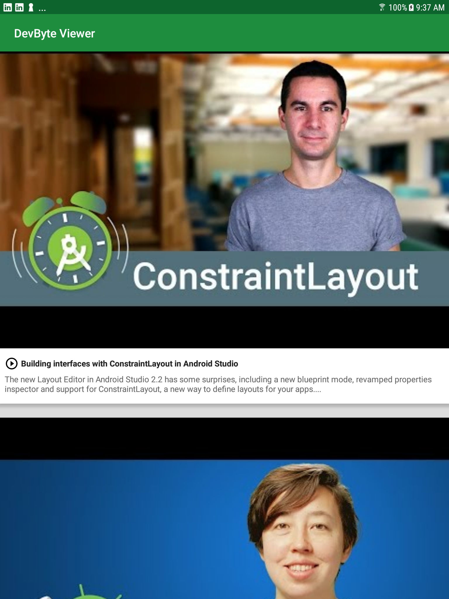

# Behind the Scenes - DevByte Viewer App

This is the app for Lesson 9 of the [Android App Development in Kotlin course on Udacity](https://classroom.udacity.com/courses/ud9012).

## DevByte

DevByte Viewer is an example app that showcases using 
[Room](https://developer.android.com/topic/libraries/architecture/room) and a Repository to create
an offline cache.

In addition, it also covers how to use 
[WorkManager](https://developer.android.com/topic/libraries/architecture/workmanager) for scheduling
periodic work. In this app it's used to setup a daily background data sync.

## Screenshots

Notes: 

Cache: Storing something for future use.  Coping data close to the place it will be used; allowing faster access.

Nework Caching: Retrofit can cache data for offline use similarly as a browser. 
	- Cache Results per Query
	- HTTP Caching
	- Store network results on disk
	- Load the Stored copy from the disk

## Topics Covered
How to use Room to create an offline cache for an application.

Best practices for implementing an offline cache. (Discussing your cache invalidation strategy witht the back-end team.

Always showing data from the database to help discover caching issues at development time.

How to implement a Repository; a way to combine multiple data sources like network request and database.

How to use WorkManager to schedule work when your app is in the background. 